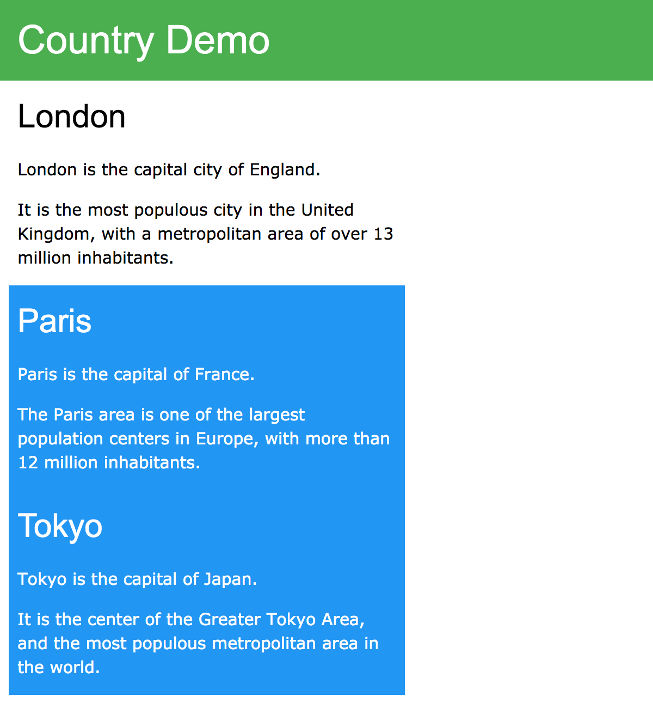
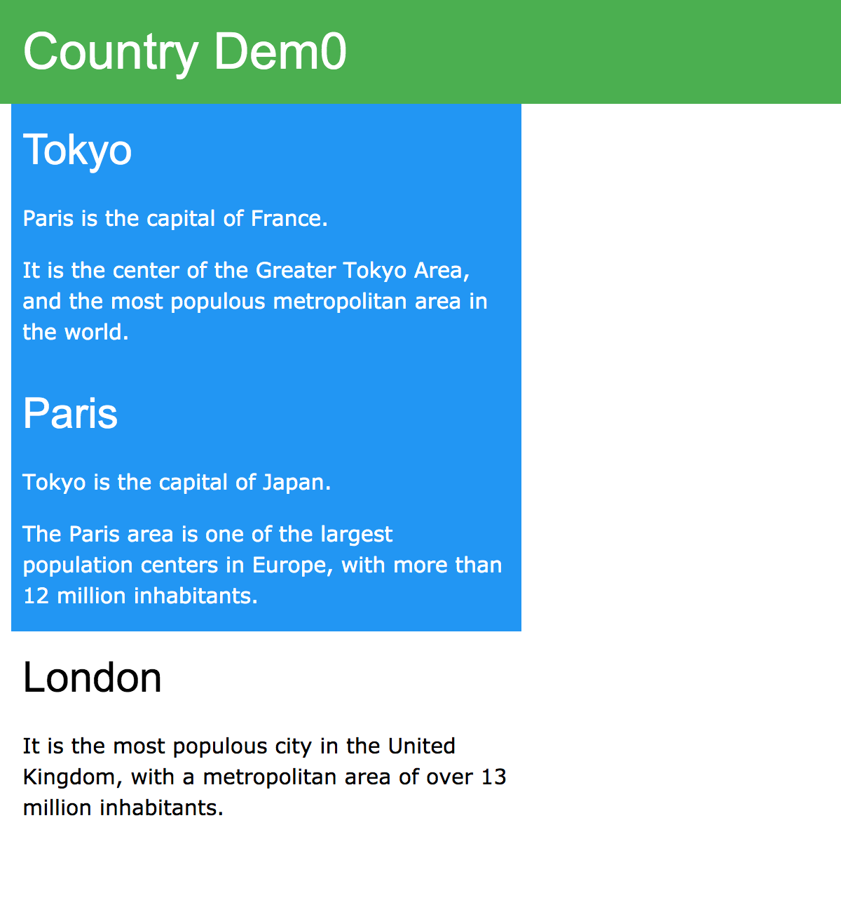
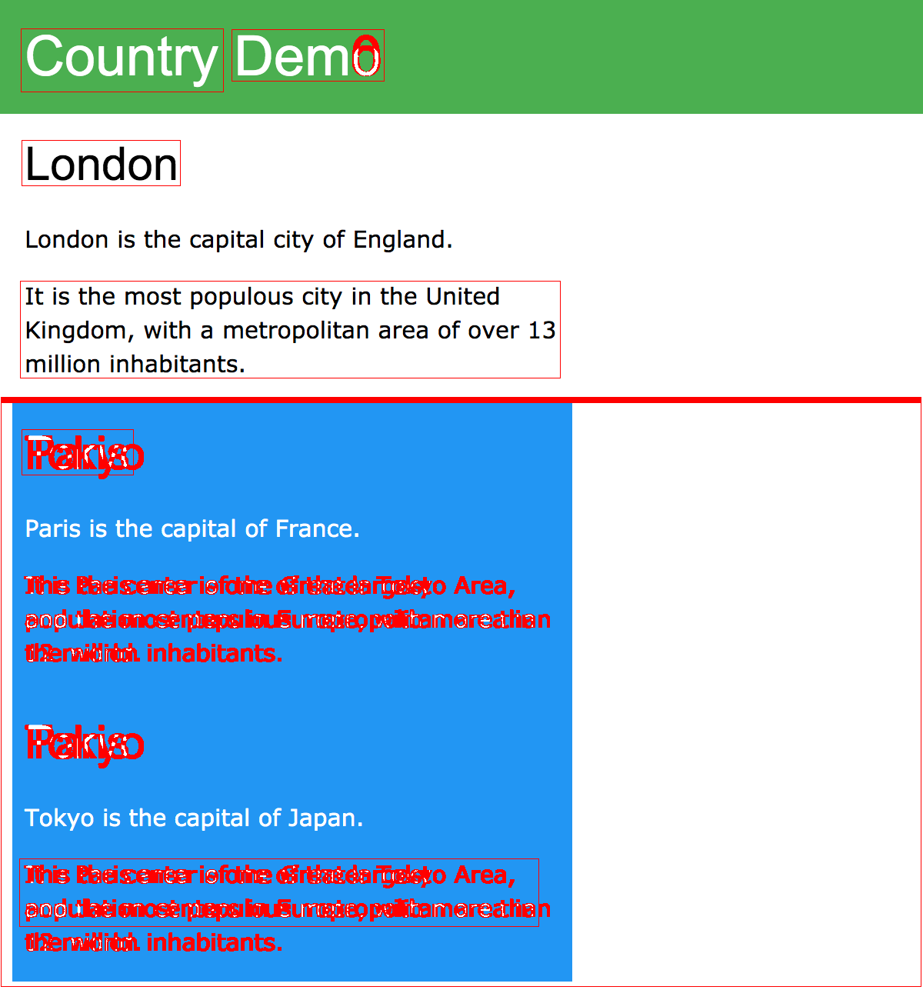

# gazosan

Detect difference between two images.


[Gazo-san](https://github.com/lifull-dev/Gazo-san) was rewritten in modern c++ (?) while making it faster. (This is my first time to write proper code in c++, so it may not be modern.)

It is at least 8 times faster as far as I can tell at hand.

Gazo-san(old)
```bash
~/w/r/g/l/gazo-san $ hyperfine --warmup 3 './bin/gazosan tests/images/test_image_new.png tests/images/test_image_old.png'
Benchmark 1: ./bin/gazosan tests/images/test_image_new.png tests/images/test_image_old.png
  Time (mean ± σ):      3.220 s ±  0.018 s    [User: 3.401 s, System: 0.263 s]
  Range (min … max):    3.187 s …  3.246 s    10 runs
```

gazosan(new)
```bash
~/w/gazo-san $ hyperfine --warmup 3 './build/gazosan -new tests/images/test_image_new.png -old tests/images/test_image_old.png'
Benchmark 1: ./build/gazosan -new tests/images/test_image_new.png -old tests/images/test_image_old.png
  Time (mean ± σ):     410.6 ms ±   7.1 ms    [User: 1194.8 ms, System: 155.6 ms]
    Range (min … max):   393.3 ms … 419.6 ms    10 runs
```

# Run

Docker

```
docker run --rm -v $(pwd):/app ghcr.io/imishinist/gazosan gazosan -new tests/images/test_image_new.png -old tests/images/test_image_old.png -perf -create_change_image
```

# Build

## requirements

- OpenCV 4
- TBB

```bash
$ mkdir build; cd build
$ cmake -DCMAKE_BUILD_TYPE=Release ..
$ cmake --build .
$ cd ..
$ ls build
~/w/gazo-san $ ls build/
CMakeCache.txt      Makefile            gazosan
CMakeFiles          cmake_install.cmake
```

| Input | Input |
| :--: | :--: |
| test_image_old.png | test_image_new.png |
|  |  |

| Output |
| :--: |
| output_diff.png |
|  | |


There is no test yet.

# License

[Apache 2.0 license](LICENSE)

# Contributors

(In alphabetical order)
* Akari Ikenoue
* [Jye Ruey](https://github.com/rueyaa332266)
* [Naoto Kishino](https://github.com/naotospace)
* [Rikiya Hikimochi](https://github.com/hikimochi)
* [Taisuke Miyazaki](https://github.com/imishinist)
